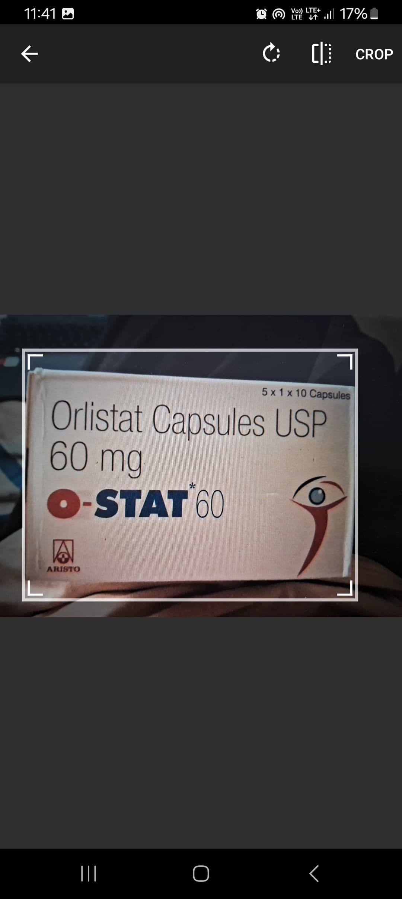
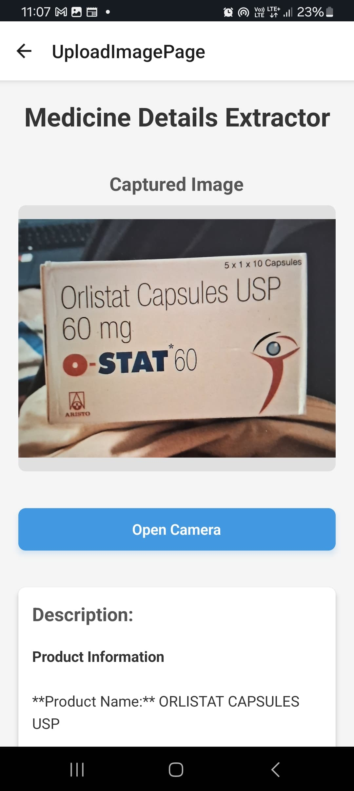
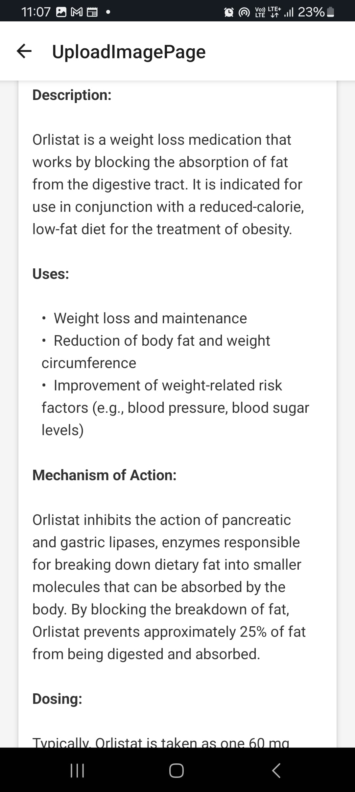
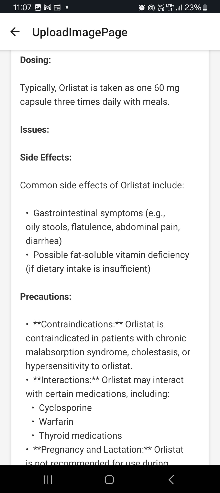
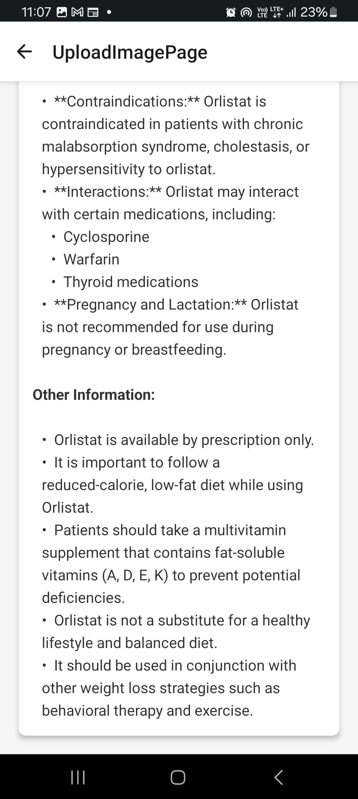

# Medicine Descripter

_A Health Genie Product_

Welcome to the **Medicine Descripter** app! This app allows you to scan and upload images of medicines, providing detailed information about them. Whether you're curious about a medicine's uses, ingredients, or dosage instructions, **Medicine Descripter** makes it easy to access the information you need, instantly.

The app features a backend powered by AI for accurate and real-time medicine recognition, while the frontend ensures a user-friendly and responsive experience.

## App Screenshots

  
  
  

  
  
  

## Features

### Frontend Features:
- Scan and upload images of medicines
- Retrieve detailed information, including:
  - Medicine Name
  - Ingredients
  - Uses and Dosage
  - Side Effects
- User-friendly and interactive interface
- Smooth navigation with intuitive UI/UX
- Real-time data retrieval powered by AI

### Backend Features:
- **AI-Powered Image Recognition**: Scans and processes uploaded images to identify medicines.
- **Medicine Database**: A comprehensive database containing detailed information about various medicines (name, ingredients, dosage, side effects, etc.).
- **API Integration**: Real-time API calls to fetch medicine details based on image recognition.
- **Data Analytics**: Collect and analyze medicine usage trends and feedback.
